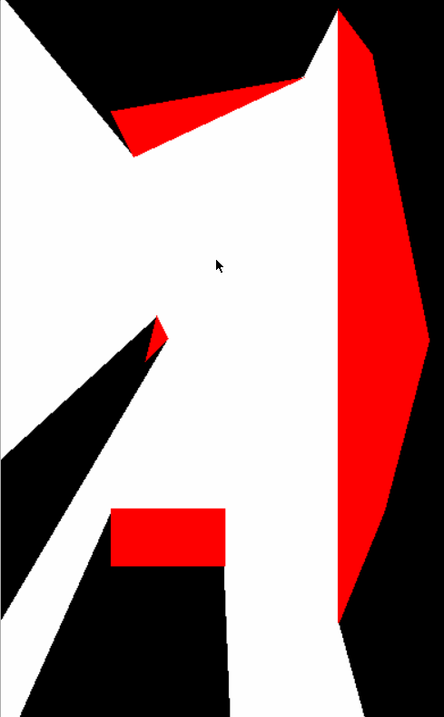
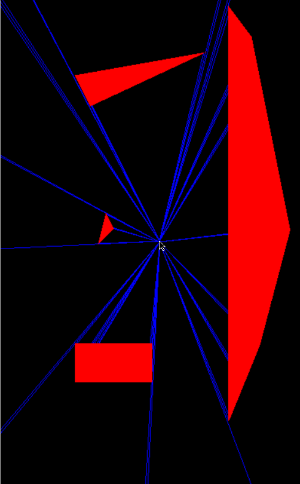

# 2D-shadow-casting
Quick 2D raycasting demo

While trying (unsuccessfully) to optimize by primitive 3D raycaster, I had the idea of only casting rays at object boundaries and the filling polygons of the screen. I couldn't get it to work in 3D, but I made this successful little 2D demo while working on it that I thought would upload here.

